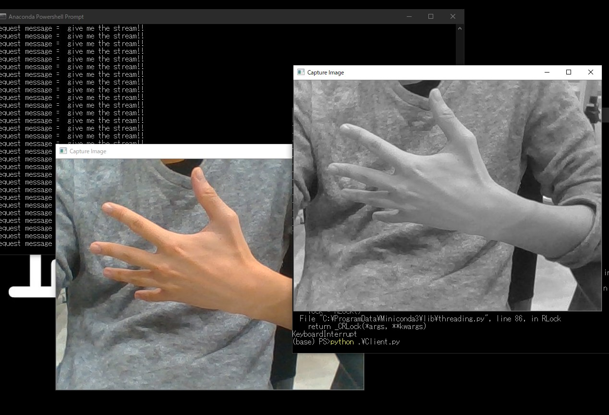

# Grpc Video Stream Sample

### Overview

The Grpc Video Stream Samples for Python3.7. 
There are two samples. 
The Streams from Server to Client. 
The Streams from Client to Server. 

### Dependency
Grpc tools for python. 
$ pip install grpcio 
$ pip install grpcio-tools 

### How to Started

#### VideoStream_fromClient_Sample
$ cd ./VideoStream_fromClient_Sample 
$ python gen.py 
$ python Server.py 
$ python Client.py 

#### VideoStream_fromServer_Sample
$ cd ./VideoStream_fromServer_Sample 
$ python gen.py 
$ python Server.py 
$ python Client.py 

### LICENS
Copyright 2015 gRPC authors. 
Licensed under the Apache License, Version 2.0 (the "License"); 
you may not use this file except in compliance with the License. 
You may obtain a copy of the License at 
http://www.apache.org/licenses/LICENSE-2.0 
Unless required by applicable law or agreed to in writing, software 
distributed under the License is distributed on an "AS IS" BASIS, 
WITHOUT WARRANTIES OR CONDITIONS OF ANY KIND, either express or implied. 
See the License for the specific language governing permissions and 
limitations under the License. 
